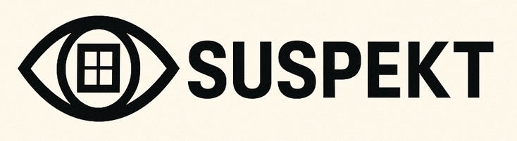

<div align="center">
    
</div>

This project aims to create a **Digital Product Pass (DPP)** system for System180's modular furniture. 
It includes a FastAPI backend to classify, manage, and store information about furniture components, as well as a simple frontend that allows users to upload or capture photos of furniture. 
The backend uses AI models to classify furniture types and detect component conditions, generating a DPP for each item.

## Usage

To start the web app with **Uvicorn**, run:

```bash
uvicorn webapp.model:app --host 0.0.0.0 --port 8000 --reload
```

Once running, access the application at [http://127.0.0.1:8000](http://127.0.0.1:8000) to upload images and detect furniture components.

Alternatively, you can start the application using Python's module system:

```bash
python -m webapp.model
```

### Docker Compose (Recommended for Scaling)

Start with:

```bash
docker-compose up -d
```

You can access the webapp at http://localhost:8000.

### Docker (manually)

Build the Docker image:

```bash
docker build -t system180-webapp .
```

Run the container:

```bash
docker run -d -p 8000:8000 --name system180-container system180-webapp
```

Now, your web app is running inside a container.
You can access it at http://localhost:8000.

For production, run with automatic restart:

```bash
docker run -d --restart always -p 8000:8000 --name system180-container system180-webapp
```
