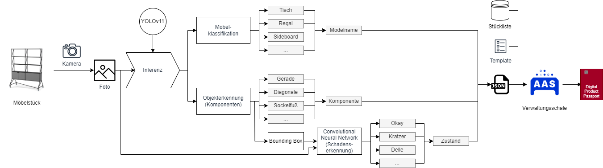

# System180 Furniture Digital Product Pass (DPP)

This project aims to create a **Digital Product Pass (DPP)** system for System180's modular furniture. 
It includes a FastAPI backend to classify, manage, and store information about furniture components, as well as a simple frontend that allows users to upload or capture photos of furniture. 
The backend uses AI models to classify furniture types and detect component conditions, generating a DPP for each item.



## Pages

| Route | Purpose |
| --- | --- |
| `/` | Upload or capture images and run detection |
| `/review_results` → `/confirm_results` | Check the bill of materials, then write the order to Neo4j — its parts stay **pending** and are not yet in the inventory |
| `/freigabe` | Release pending orders into the digital inventory: correct or remove single parts, release or discard the order. Below that, a collapsible, searchable archive of **all** orders for later corrections or deletion (staff only) |
| `/inventory` | Digital inventory of released components |
| `/resource` | Material reuse, CO₂ savings, transport emissions, order map |
| `/video` | Detection on uploaded MP4/MOV files |
| `/training` | Label Studio setup, pre-labeling, YOLO dataset export, upload/activation of model versions |
| `/decordetection/manage_colors` | Décor and coating palette (`colors.json`, `beschichtung.json`) |
| `/login` | Staff login — `/freigabe`, `/training` and the admin actions require it |

## Configuration

Credentials come from `.env` in this folder (template: `.env.example`):

| Variable | Purpose |
| --- | --- |
| `NEO4J_URI`, `NEO4J_USER`, `NEO4J_PASSWORD` | Knowledge graph connection |
| `HERE_API_KEY` | Geocoding of order addresses and transport distances |

Under docker compose the three `NEO4J_*` values are overridden and point at the
bundled local Neo4j service, so the stack never depends on an external Aura
instance.

## Usage

To start the web app with **Uvicorn**, run:

```bash
uvicorn webapp.model:app --host 0.0.0.0 --port 8000 --reload
```

Once running, access the application at [http://127.0.0.1:8000](http://127.0.0.1:8000) to upload images and detect furniture components.

Alternatively, you can start the application using Python's module system:

```bash
python -m webapp.model
```

### Docker Compose (Recommended for Scaling)

Start with:

```bash
docker compose up -d
```

| Service | Port | Notes |
| --- | --- | --- |
| `webapp` | 8000 | FastAPI app (Uvicorn) |
| `neo4j` | 7474 (browser), 7687 (bolt) | Neo4j 5 Community, data in `./neo4j-data` |
| `labelstudio` | 8082 | Labeling backend for the retraining loop, data in `./labelstudio-data`, synced captures read from `./training_captures` |
| `nginx` | 80, 443 | TLS termination and gzip — only started with `--profile production` |

Persisted outside the containers, so a rebuild keeps them: `./neo4j-data`
(graph), `./config` (Label Studio token, model registry), `./model` (uploaded
model versions), `./labelstudio-data`, `./training_captures`.

**After code changes:** application code, templates and static files are copied
into the image at build time, so a plain restart keeps serving the old version:

```bash
docker compose up -d --build webapp
```

`nginx.conf` on the other hand is bind-mounted — changes there only need a
reload of the running container:

```bash
docker exec webapp-nginx-1 nginx -s reload
```

For the public deployment (TLS certificates from `/etc/letsencrypt`):

```bash
docker compose --profile production up -d
```

See `docs/deployment.md` for the full server playbook.

### Docker (manually)

Build the Docker image:

```bash
docker build -t system180-webapp .
```

Run the container:

```bash
docker run -d -p 8000:8000 --name system180-container system180-webapp
```

Now, your web app is running inside a container.
You can access it at http://localhost:8000.

For production, run with automatic restart:

```bash
docker run -d --restart always -p 8000:8000 --name system180-container system180-webapp
```
